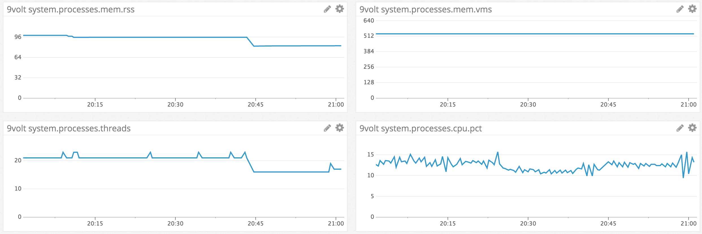

# 9volt Performance Docs

Initial (semi-anecdotal) performance testing has been done on the following system:

* quad-core 2.6Ghz i7, 16GB RAM, 512GB SSD, OS X 10.11 (El Capitan)
* go1.7.4 darwin/amd64

Total workload of 1,000 running checks with the following configuration:

* 100 x "exec" checks (`echo` that expects specific output + return code):
    ```yaml
  exec-check0:
    type: exec
    description: exec check test
    timeout: 5s
    command: echo
    args:
      - hello
      - world
    interval: 10s
    return-code: 1
    expect: world
    warning-threshold: 1
    critical-threshold: 3
    warning-alerter:
      - primary-slack
    critical-alerter:
      - primary-email
    tags:
      - dbservers
      - mysql
    ```

*  300 x `tcp` ssh checks (basic remote, open port check):
    ```yaml
  ssh-tcp-check0:
    type: tcp
    description: "remote tcp check, no thrills"
    host: cloudsy.com
    timeout: 5s
    interval: 10s
    port: 12345
    tags:
      - team-core
      - golang
    warning-threshold: 1
    critical-threshold: 3
    warning-alerter:
      - primary-pagerduty
    critical-alerter:
      - primary-pagerduty
    ```

* 300 x `http` checks (expects 200 status):
    ```yaml
  basic-http-check0:
    type: http
    description: "basic http status code check"
    host: cloudsy.com
    timeout: 5s
    interval: 10s
    enabled: true
    port: 80
    status-code: 200
    tags:
      - team-core
      - golang
    warning-threshold: 1
    critical-threshold: 3
    warning-alerter:
      - primary-slack
    critical-alerter:
      - primary-slack
      - primary-pagerduty
    ```

* 300 x `tcp` checks (open port + expect output):
    ```yaml
  ssh-expect-ssh-check158:
    type: tcp
    description: "remote tcp check with expect"
    host: cloudsy.com
    timeout: 5s
    interval: 10s
    disable: true
    expect: OpenSSH
    port: 22
    tags:
      - team-core
      - golang
    warning-threshold: 1
    critical-threshold: 3
    warning-alerter:
      - secondary-slack
    critical-alerter:
      - secondary-slack
      - primary-pagerduty
    ```

9volt was ran with that configuration for ~1 hr; CPU, memory and thread-usage metrics were collected by datadog that resulted in the following graphs:



So, with 1,000 active checks (running on a 10s interval):

* CPU usage did not exceed 16%
* Max rss memory 96MB (and then went down to ~82MB)
* Thread usage averaging at 17

TODO: Provide additional benchmark/performance metrics from a production `9volt` use case.

TODO2: Provide folks with a way to run their own benchmarks.
